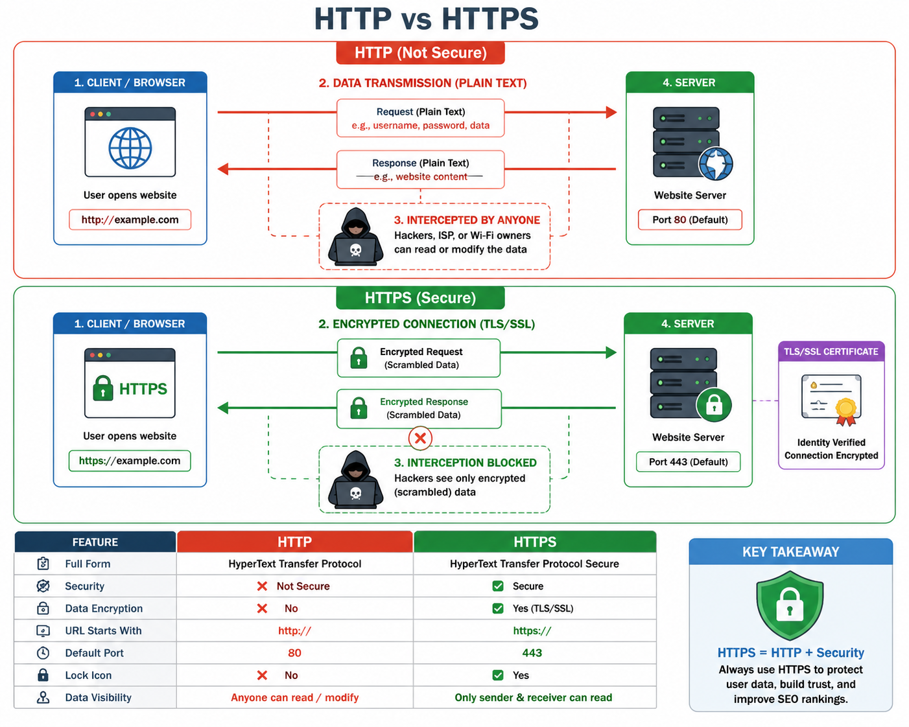

# HTTP vs HTTPS

## Overview
HTTP and HTTPS are both protocols used to transfer data between a browser and a web server.

- HTTP stands for Hypertext Transfer Protocol.
- HTTPS stands for Hypertext Transfer Protocol Secure.

## Main Difference
The main difference is security.

- HTTP sends data in plain text.
- HTTPS encrypts the data using SSL/TLS before sending it.

## Why HTTPS is Better
HTTPS provides:

- Data encryption
- Secure communication between client and server
- Protection against hackers and eavesdropping
- Better trust for users

## Simple Comparison

| Feature | HTTP | HTTPS |
|--------|------|-------|
| Security | No | Yes |
| Encryption | No | Yes |
| Data Protection | Low | High |
| Trust Level | Low | High |
| Port | 80 | 443 |

## Example
- A website using HTTP: http://example.com
- A website using HTTPS: https://example.com

## Conclusion
Use HTTPS whenever possible because it keeps your information safe and makes the website more secure.

Here is complete architicture:

